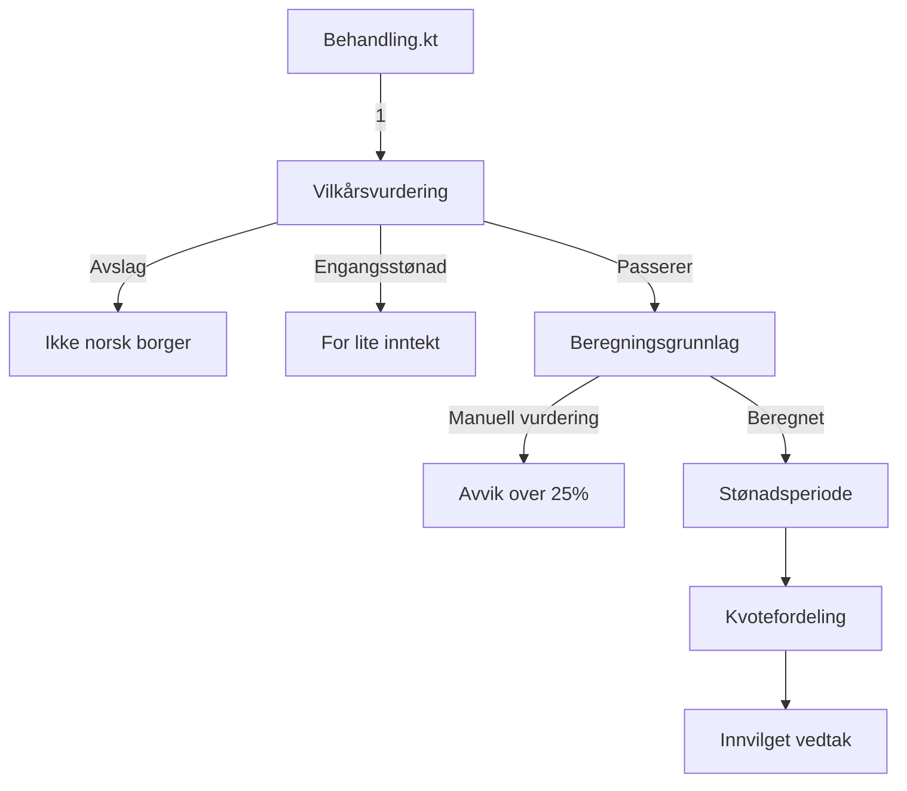

# fagprove-backend-sandra

Backend for forenklet saksbehandlingssystem for foreldrepenger. Henter søknader fra et eksternt API, kjører dem gjennom en regelmotor og returnerer vedtak. Bygget med Kotlin og Ktor.

## Teknologier

| Teknologi             | Versjon | Formål                                |
| --------------------- | ------- | ------------------------------------- |
| Kotlin                | 2.3     | Programmeringsspråk (JVM 21)          |
| Ktor                  | 3.5.0   | HTTP-server og klient                 |
| kotlinx.serialization | 2.3.21  | JSON-serialisering med @Serializable  |
| Gradle                | -       | Byggverktøy, avhengigheter og kjøring |
| Logback               | 1.5     | Logging til konsollen                 |

## Arkitektur

Applikasjonen har tre hovedlag:

### 1. Klienter (`klient/`)

Henter data fra eksterne tjenester med Ktor Client og kotlinx.serialization:

| Klient             | URL                                                   | Beskrivelse                     |
| ------------------ | ----------------------------------------------------- | ------------------------------- |
| `SoknadClient`     | `https://api.digisis.org/api/foreldrepenger/soknader` | Henter søknader                 |
| `GrunnbelopClient` | `https://g.nav.no/api/v1/grunnbeløp`                  | Henter gjeldende grunnbeløp (G) |

HTTP-klienten er konfigurert med `ignoreUnknownKeys = true` slik at ukjente felt i JSON-responsen ignoreres.

### 2. Regler (`regler/`)

Regelmotor som behandler søknader i fire steg:



**Vilkårsvurdering** — sjekker tre ting i rekkefølge: om søker er norsk borger (avslag hvis ikke), om søker har godkjent inntekt i minst 6 av de 10 siste månedene før termin, og om annualisert inntekt er over 0,5G. De to siste gir engangsstønad (hardkodet beløp på 92 648 kr) hvis de feiler. Godkjente inntektstyper defineres i `Inntektstype`-enumen med funksjonen `erGodkjent()` — alle typer bortsett fra `STIPEND_LANEKASSEN` er godkjent.

**Beregningsgrunnlag** — henter godkjent inntekt fra de 3 siste månedene før termin, beregner gjennomsnitt og annualiserer (×12). Hvis avviket mellom beregnet og oppgitt årsinntekt er over 25%, returneres null som gjøres om til manuell vurdering i `Behandling.kt`. Beregningsgrunnlaget kappes ved 6G.

**Stønadsperiode** — beregner antall uker basert på rettsforhold (begge/kun-mor/kun-far), dekningsgrad (80%/100%) og antall barn. Implementert med Kotlins `when`-uttrykk som slår opp riktig verdi fra tabellen i case-oppgaven. «Begge» og «kun-mor» deler samme verdier.

**Kvotefordeling** — fordeler totalperioden i fem deler: forhåndskvote (3 uker til mor før termin), mødrekvote, fedrekvote, flerbarnsbonus og fellesperiode. Fellesperioden beregnes som resten av totalen minus alle andre poster. Når rettsforholdet er kun-mor eller kun-far tildeles alle uker til den ene forelderen.

### 3. Modeller (`modell/`)

- `Soknad` — dataklasse med felter som matcher JSON-responsen fra søknads-API-et, inkludert `Inntekt` med `Inntektstype`-enum
- `Vedtak` — sealed class med fire varianter: `Avslag`, `Engangsstonad`, `ManuellVurdering` og `Innvilget`. Avslag, engangsstønad og manuell vurdering har begrunnelse, engangsstønad har i tillegg beløp, og innvilget har beregningsgrunnlag, stønadsperiode og kvoter
- `BehandletSoknad` — kombinerer en søknad med vedtaket

### Mappestruktur

```
src/main/kotlin/
├── main.kt                        # Inngangspunkt
├── Routing.kt                     # API-ruting og ContentNegotiation
├── klient/
│   ├── GrunnbelopClient.kt        # Henter grunnbeløp fra g.nav.no
│   └── SoknadClient.kt            # Henter søknader fra digisis API
├── modell/
│   ├── BehandletSoknad.kt         # Søknad + vedtak
│   ├── Soknad.kt                  # Søknadsmodell med inntektshistorikk
│   └── Vedtak.kt                  # Sealed class for vedtakstyper
└── regler/
    ├── Behandling.kt              # Orkestrerer regelkjøring
    ├── Beregningsgrunnlag.kt      # Beregner inntektsgrunnlag
    ├── Kvotefordeling.kt          # Fordeler uker i kvoter
    ├── Stonadsperiode.kt          # Beregner total stønadsperiode
    └── Vilkarsvurdering.kt        # Sjekker inngangsvilkår
```

## API

| Metode | Endepunkt       | Beskrivelse                         |
| ------ | --------------- | ----------------------------------- |
| GET    | `/api/soknader` | Returnerer alle søknader med vedtak |

Returnerer `503 Service Unavailable` med en beskrivende feilmelding hvis de eksterne API-ene er nede. Feilhåndteringen ligger som try-catch i `Routing.kt`.

## Tester

```
src/test/kotlin/
├── SoknadTest.kt                  # Integrasjonstest: returnerer 200 og gyldige felter
└── regler/
    ├── BeregningsgrunnlagTest.kt   # Beregning fra 3 mnd, avvik gir null, kapping ved 6G
    ├── KvotefordelingTest.kt       # Begge/kun-mor/kun-far, flerbarnsbonus
    ├── StonadsperiodeTest.kt       # Ulike kombinasjoner av rettsforhold/barn/dekningsgrad
    └── VilkarsvurderingTest.kt     # Borgerskap, for få måneder, inntekt under 0,5G
```

## Kjøre lokalt

Forutsetninger: JDK 21.

```bash
./gradlew run
```

Serveren starter på `http://localhost:8080`.

## Kjøre tester

```bash
./gradlew test
```
